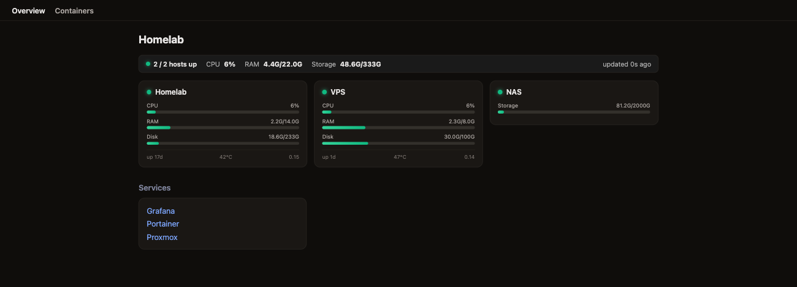
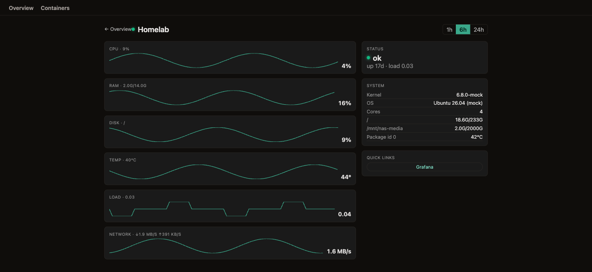
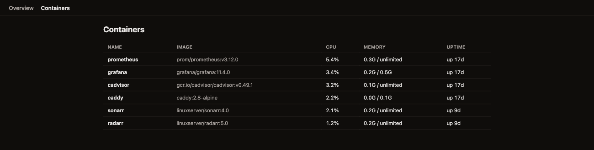

# homelab-dashboard

A single pane of glass for your homelab — Homepage-style service widgets and Beszel-style system monitoring in one self-hosted, well-designed OSS tool.

[](https://github.com/adrianbrandt/homelab-dashboard/actions/workflows/ci.yml)
[](LICENSE)
[](https://github.com/adrianbrandt/homelab-dashboard/pkgs/container/homelab-dashboard)

---

## What it is

Most homelab dashboards do one thing well. **Homepage** excels at service widgets — bookmarks and live tiles that show your Sonarr queue, AdGuard stats, and so on. **Beszel** excels at system monitoring — CPU, RAM, disk, and container health at a glance. Nothing does both in one well-designed, self-hosted package.

**homelab-dashboard** fills that gap. It is a config-driven dashboard that combines:

- **Service widgets** — live tiles for Sonarr, Radarr, AdGuard, and bookmarks, with a simple two-sided contract that makes adding more widgets straightforward.
- **System monitoring** — per-host CPU, RAM, disk, temperature, uptime, and load from Prometheus + node_exporter; fleet overview + per-host detail with sparklines; container health from cAdvisor.

Everything lives in a single YAML file. Secrets are never sent to the browser. The whole stack ships as one Docker image.

---

## Screenshots



*Fleet overview: summary strip, per-host health cards, and service widget groups.*



*Per-host detail: CPU/RAM/disk/temperature sparklines with a 1h/6h/24h range toggle and system information sidebar.*



*Containers view: fleet-wide CPU, memory, and uptime for every running container.*

---

## Quick start

### Try it in mock mode — no config required

```bash
docker run --rm -p 3001:3001 -e DATA_SOURCE=mock \
  ghcr.io/adrianbrandt/homelab-dashboard:latest
# open http://localhost:3001
```

Mock mode uses synthetic data so you can explore the UI before wiring up real services.

### Run it for real

Create a `config/config.yaml` (see [Configuration](#configuration) below) and a `.env` file with your secrets, then use this `docker-compose.yml`:

```yaml
services:
  dashboard:
    image: ghcr.io/adrianbrandt/homelab-dashboard:latest
    restart: unless-stopped
    ports:
      - "3001:3001"
    env_file: .env
    environment:
      DATA_SOURCE: prometheus
      PROMETHEUS_URL: http://prometheus:9090
    volumes:
      - ./config/config.yaml:/config/config.yaml:ro
```

Your `.env` file holds the secrets referenced as `{{ENV_VAR}}` in `config.yaml`:

```env
SONARR_KEY=your-sonarr-api-key
RADARR_KEY=your-radarr-api-key
ADGUARD_PASS=your-adguard-password
```

The dashboard is available on port 3001. For production, put it behind a reverse proxy with authentication — see [Security model](#security-model).

---

## Configuration

Everything is driven by a single YAML file mounted at `/config/config.yaml` (override with the `CONFIG_PATH` environment variable).

The config has two top-level sections:

**`hosts:`** — the machines you want to monitor. Each host has an `id`, a display `label`, and a `source` that maps it to a Prometheus `instance` label. A `links:` list adds quick-launch buttons on each host card. Storage-only hosts (NAS, external drives) use `kind: storage` and a `mountpoint`.

**`groups:`** — collections of service widgets displayed below the host grid. Each group has a `name` and a list of `widgets:`, each with a `type` and its connection details.

**Secrets** are never inlined in the config file. Instead, use `{{ENV_VAR}}` placeholders — they are resolved server-side at startup from the process environment and are never sent to the browser. This means `config.yaml` is safe to commit.

See [`config.example.yaml`](config.example.yaml) for the full annotated shape:

```yaml
settings:
  title: Homelab

hosts:
  - id: homelab
    label: homelab
    source: { type: prometheus, instance: homelab }
    links:
      - { label: Grafana, url: https://grafana.example.com }

groups:
  - name: Media
    widgets:
      - type: sonarr
        url: http://192.168.1.10:8989
        key: "{{SONARR_KEY}}"
      - type: radarr
        url: http://192.168.1.10:7878
        key: "{{RADARR_KEY}}"
  - name: Infra
    widgets:
      - type: adguard
        url: http://192.168.1.10:3001
        username: admin
        password: "{{ADGUARD_PASS}}"
      - type: bookmarks
        items:
          - { label: Portainer, url: https://portainer.example.com }
```

---

## Available widgets

| Widget | Config fields | What it shows |
|--------|---------------|---------------|
| `sonarr` | `url`, `key` | Queue size, total series, upcoming episodes (7-day calendar) |
| `radarr` | `url`, `key` | Queue size, total movies, missing movies count |
| `adguard` | `url`, `username`, `password` | Total DNS queries, blocked queries, blocked percentage |
| `bookmarks` | `items: [{label, url}]` | Quick-launch links — no external API required |

`key` fields use the service's built-in API key (Sonarr/Radarr: Settings → General → API Key). All credentials are `{{ENV_VAR}}` references in the config — they reach the server via the `.env` file and are never forwarded to the browser.

---

## Security model

> **homelab-dashboard has no built-in authentication yet.** Do **not** expose it directly to the internet. Run it on your LAN, or put it behind your own reverse proxy + auth (Authelia / Authentik / Cloudflare Access / Caddy basic_auth / Tailscale). Secrets in `config.yaml` are resolved server-side via `{{ENV}}` and are never sent to the browser, but the dashboard itself is unauthenticated. Pluggable forward-auth (header trust) is on the [roadmap](ROADMAP.md).

See [SECURITY.md](SECURITY.md) for the full security posture and how to report vulnerabilities.

---

## Architecture and extending

homelab-dashboard is a **single-origin** app: one Express process serves both the JSON API (`/api/*`) and the built Vite + React SPA from `/web/dist`. One image, one port, one proxy rule.

### Extension points

**`DataSource` seam** (`server/src/datasource/`) — the interface that abstracts where monitoring data comes from. Two implementations ship: `mock` (synthetic fixtures, no real services needed) and `prometheus` (reads from Prometheus + node_exporter for host metrics, cAdvisor for containers). Swapping or extending the data backend means implementing four methods: `getHosts`, `getHostDetail`, `getHostSeries`, `getContainers`.

**Two-sided widget contract** — each widget is a pair: a server module in `server/src/widgets/<name>.ts` that fetches from a service API and returns only the happy-path data, and a web tile in `web/src/widgets/<Name>.tsx` that renders it. A shared type in `shared/src/index.ts` connects the two. The server-side `runWidget` host owns the 8-second timeout and error wrapping — widget modules never handle their own errors. See [CONTRIBUTING.md](CONTRIBUTING.md) for the step-by-step walkthrough.

The `prometheus` data source expects:
- [Prometheus](https://prometheus.io/) scraping your hosts
- [node_exporter](https://github.com/prometheus/node_exporter) on each host (provides CPU, RAM, disk, temperature, network)
- [cAdvisor](https://github.com/google/cadvisor) for the containers view

---

## Roadmap · Contributing · License

**[Roadmap](ROADMAP.md)** — upcoming milestones: pluggable forward-auth, published image, theming, more widgets.

**[Contributing](CONTRIBUTING.md)** — dev setup, conventions, and a step-by-step guide to adding a new service widget.

**License** — MIT. See [LICENSE](LICENSE).
